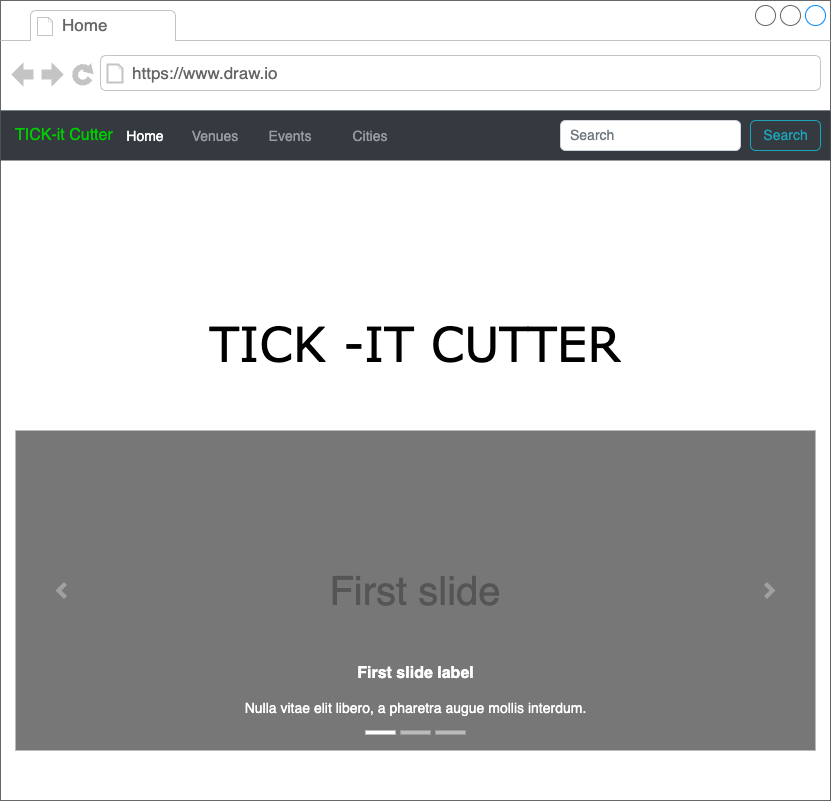
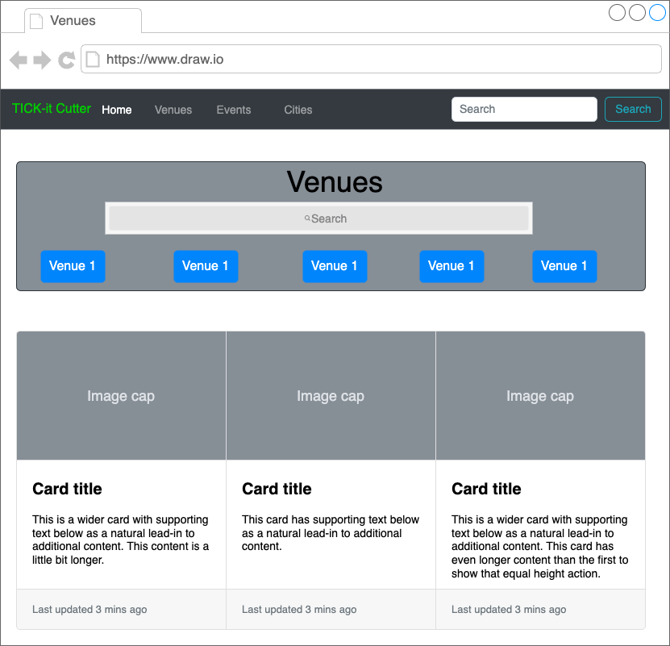
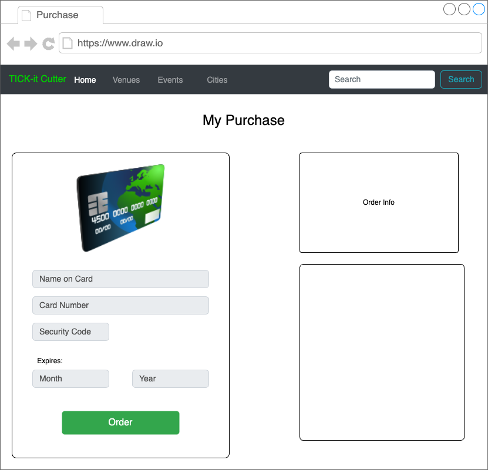
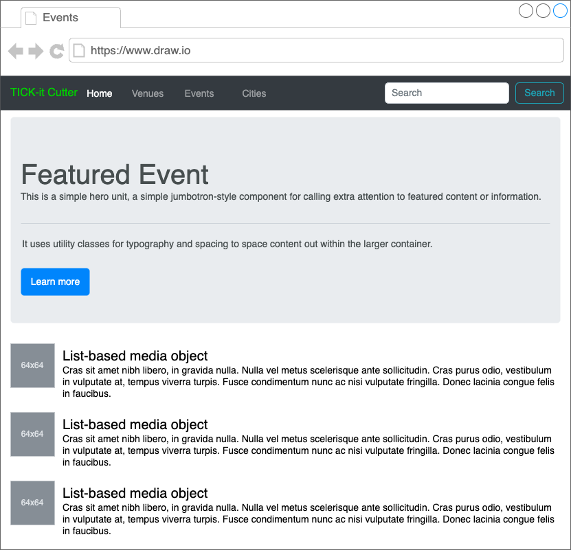

# Tick-it Cutter (Django-fullstack-frontend)
- Note: This is only the frontend, to see the backend go [here](https://github.com/TheSaltyNewfie/django-fullstack-backend/)

# Tech Stack
- Front end
    - React
    - JS
    - Axios
    - Bootstrap
    - Docker (For hosting)

- Back end
    - Python
    - Django
    - Postgresql
    - Docker (For hosting)

# Roles

    Leon - React/CSS
    Sebastian - React/CSS/Django
    Tobias - Django/React

# ERD
- Venues
    - Name: CharField
    - Location: TextField
    - Description: TextField

- Artists
    - Name: CharField
    - Genre: TextField
    - Description: TextField
    - Picture: CharField

- Events
    - Name: CharField
    - Venue: Foreign key to Venues
    - Artists: Foreign key to Artists
    - Entry_Fee: FloatField

# Wireframes

